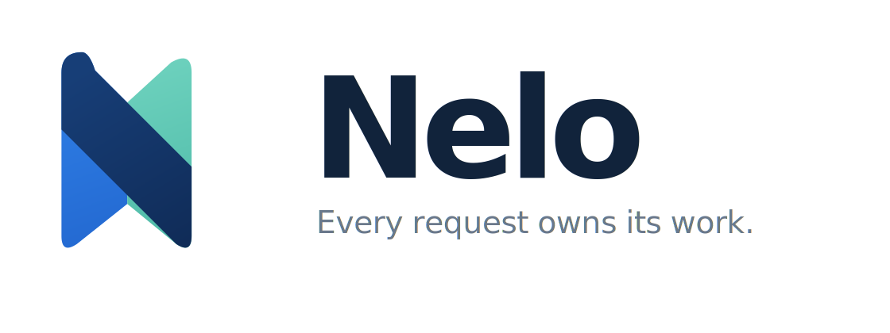

<p align="center">
  <picture>
    <source media="(prefers-color-scheme: dark)" srcset="./assets/nelo-wordmark-on-dark.svg">
    <source media="(prefers-color-scheme: light)" srcset="./assets/nelo-wordmark-on-light.svg">
    
  </picture>
</p>

<p align="center">
  <strong>A request-ownership runtime and Web Standards framework for TypeScript.</strong><br>
  <sub>Keep child tasks, cancellation, scoped resources, and response delivery inside the request that created them.</sub>
</p>

<p align="center">
  
  
  
  <a href="./LICENSE"></a>
</p>

<p align="center">
  English · <a href="./README.ja.md">日本語</a> · <a href="https://nelo.lattee.jp">Website</a>
</p>

Nelo treats a request as the owner of the work started for it. A handler may return a `Response`
while tasks are still running, resources are still open, or a response body is still being
delivered. Nelo keeps those operations inside explicit lifetime boundaries so they can be awaited,
cancelled, released, or transferred deliberately.

> Returning a `Response` is not the same as completing the request lifetime.

## Why Nelo

Ordinary asynchronous handlers can leave work behind:

- a promise continues after nobody is waiting for it;
- a client disconnects, but related operations keep running;
- a resource closes when the handler returns even though a stream still needs it;
- failures during cleanup or delivery are lost;
- shutdown begins while request-owned work remains active.

Nelo makes the ownership of that work visible without replacing standard `Request`, `Response`,
`Headers`, `URL`, `ReadableStream`, or `AbortSignal` APIs.

## Lifetime model

```text
Request lifetime
├── Handler scope
│   ├── middleware
│   ├── context.fork()
│   └── context.use()
└── Delivery scope
    ├── Response.body
    ├── context.delivery.fork()
    └── context.delivery.use()
```

The handler scope closes after the handler finishes. The delivery scope remains active until the
response body completes, fails, is cancelled, or the transport reports a disconnect. Owned resources
are released once, in reverse acquisition order.

## Example

```ts
import { Nelo } from "nelo";

const app = new Nelo();

app.get("/users/:id", async (context) => {
  const user = context.fork("user", (signal) => fetchUser(context.params.id!, { signal }));

  const feed = context.fork("feed", (signal) => fetchFeed(context.params.id!, { signal }));

  return context.json({
    user: await user,
    feed: await feed,
  });
});
```

The import above shows the intended public API. Package publication and availability are not claimed
until the final package name is cleared.

Nelo must own a task from the moment it starts. It does not attach reliable cancellation to an
arbitrary promise after that promise is already running.

## Core API

| API                                      | Purpose                                                               |
| ---------------------------------------- | --------------------------------------------------------------------- |
| `app.fetch(request)`                     | Runs routing, middleware, the handler, and owned response delivery.   |
| `context.fork(name, operation)`          | Starts an eager task owned by the current request.                    |
| `context.signal`                         | Exposes cooperative cancellation to request-owned work.               |
| `context.use(name, acquire, cleanup?)`   | Acquires a handler-owned resource and releases it once in LIFO order. |
| `context.delivery.fork(name, operation)` | Starts work owned by response delivery.                               |
| `context.delivery.use(cleanup)`          | Keeps cleanup attached to the delivery scope.                         |
| `LifetimeScope#createChild(name)`        | Creates an explicit child ownership boundary.                         |

### Owned tasks

`context.fork()` returns an awaitable `OwnedTask`. The task retains its name, parent scope,
settlement state, and failure for diagnostics.

```ts
const profile = context.fork("profile", (signal) => loadProfile({ signal }));

return context.json(await profile);
```

If an owned task is neither observed nor transferred before its scope completes, Nelo requests
cancellation and reports `NELO_TASK_001` instead of silently accepting detached work.

### Cooperative cancellation

Nelo preserves the first typed cancellation reason and propagates one `AbortSignal` through child
scopes and owned tasks. Cancellation remains cooperative: JavaScript cannot forcibly stop an
arbitrary promise, so operations must observe the supplied signal and stop safely.

### Scoped resources

```ts
const connection = await context.use(
  "database",
  (signal) => database.connect({ signal }),
  (resource) => resource.close(),
);
```

Resources are released once, in reverse acquisition order, after owned work settles. Handler, task,
and cleanup failures remain observable and are aggregated when necessary.

### Delivery-owned resources

A resource created for a response stream often needs to remain open after the handler returns.
Register its cleanup with the delivery scope:

```ts
app.get("/stream", async (context) => {
  const resource = await openResource();
  context.delivery.use(() => resource.close());

  return new Response(resource.stream());
});
```

The delivery scope closes after body completion, cancellation, producer failure, client disconnect,
or server shutdown.

## Web framework surface

The current portable surface includes:

- Fetch-style `app.fetch(Request)` execution;
- static routes and named path parameters;
- method matching with `404` and `405` handling;
- deterministic static-over-parameter precedence;
- global and route middleware;
- single-use middleware `next()` enforcement;
- centralized error handling;
- `json`, `text`, `fork`, `use`, and `delivery` helpers;
- bounded diagnostics for tasks that ignore cancellation;
- handler- and delivery-phase cleanup failure reporting.

## Runtime support

| Capability                    | Portable core | Node.js | Cloudflare |  Deno   |   Bun   |
| ----------------------------- | :-----------: | :-----: | :--------: | :-----: | :-----: |
| Request scopes                |      ✅       |    —    |     —      |   ✅    |    —    |
| Owned tasks                   |      ✅       |    —    |     —      |   ✅    |    —    |
| Resource cleanup              |      ✅       |    —    |     —      |   ✅    |    —    |
| Response delivery tracking    |      ✅       |   ✅    |  Planned   | Planned | Planned |
| Client disconnect integration |       —       |   ✅    |  Planned   | Planned | Planned |
| Graceful shutdown             |       —       |   ✅    |  Planned   | Planned | Planned |
| Deferred work                 |       —       | Planned |  Planned   | Planned | Planned |

The portable core wraps `Response.body` at the observable body boundary. The Node.js adapter also
maps transport disconnects, backpressure, and shutdown into the same lifetime model.

## Current limits

Nelo does not currently claim:

- forced cancellation of arbitrary promises;
- proof that a client physically received every response byte;
- durable or exactly-once background execution;
- complete Cloudflare, Deno, or Bun adapters;
- identical transport behavior across every runtime.

Runtime behavior is documented as supported only after the corresponding adapter and transport tests
exist.

## Development

The public package name is not final. Build and test the current source checkout directly:

```bash
git clone https://github.com/lasder-ca/Nelo.git
cd Nelo
npm install

npm run format
npm run lint
npm run typecheck
npm test
npm run build
npm run check:package
npm run check:tarball
npm run pack:dry-run
```

## Roadmap

- **Phase 1 — complete:** lifetime scopes, owned tasks, typed cancellation, and resource cleanup.
- **Phase 2 — complete:** Fetch-style application API, routing, middleware, context, and error
  handling.
- **Phase 3 — complete:** Node.js adapter, real-socket disconnect tests, delivery tracking, graceful
  shutdown, and CI.
- **Phase 4 — complete:** separate handler and delivery scopes, delivery-owned work, typed abort
  reasons, cleanup-failure aggregation, and request diagnostics.
- **Later:** additional runtime adapters, explicit deferred work, and diagnostic tooling.

## License

Nelo is available under the [Apache License 2.0](./LICENSE).
